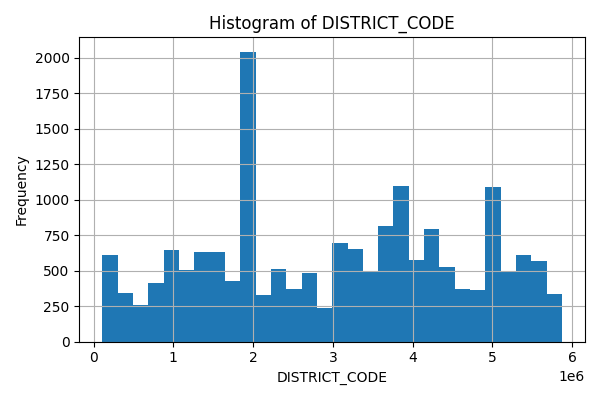
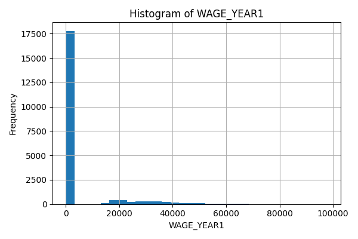
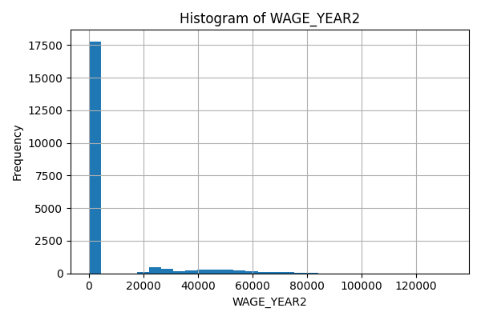
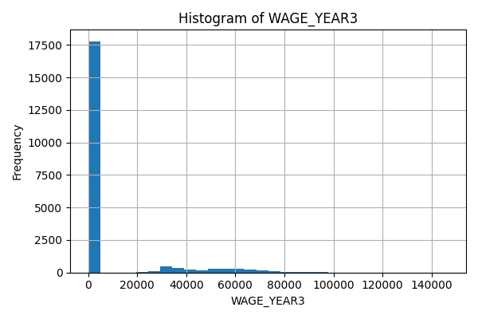
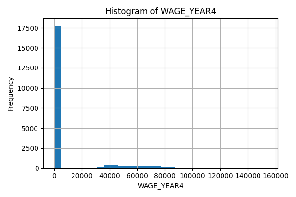

# x62-data-challenge-student-pathways

Part 1: Data Exploration
1. Data Quality - For each feature (column), what is the data type? Is there any missing data?
The following information describes the features of the columns
Data columns (total 11 columns):
 #   Column              Non-Null Count  Dtype  
---  ------              --------------  -----  
 0   DISTRICT_TYPE       20705 non-null  object 
 1   DISTRICT_NAME       20705 non-null  object 
 2   DISTRICT_CODE       17960 non-null  float64
 3   ACADEMIC_YEAR       20705 non-null  object 
 4   DEMO_CATEGORY       20705 non-null  object 
 5   STUDENT_POPULATION  20705 non-null  object 
 6   AWARD_CATEGORY      20705 non-null  object 
 7   WAGE_YEAR1          20705 non-null  float64
 8   WAGE_YEAR2          20705 non-null  float64
 9   WAGE_YEAR3          20705 non-null  float64
 10  WAGE_YEAR4          20705 non-null  float64
 For features DISTRICT_TYPE, DISTRICT_NAME, ACADEMIC_YEAR, DEMO_CATEGORY, STUDENT_POPULATION, AWARD_CATEGORY are represented as the object data type, but within the actual csv file, we can see that the object is just a string. For the remaining features, they are float64 data types. Additionally, we can see that in DISTRICT_CODE, there are a few thousand missing entries, as there is only 17960 out of 20705 having non-null values.

2. What are the unique values for each categorical column? What is the range of values of the numeric columns? Are the numeric column values normally distributed?
The unique values for each categorical column are shown below
Column: DISTRICT_TYPE
DISTRICT_TYPE
School District         17960
Legislative District     2702
All                        43
Name: count, dtype: int64
Unique count: 3

Column: DISTRICT_NAME
DISTRICT_NAME
Southern Trinity Joint Unified              56
Trinity County Office of Education          55
Santa Barbara County Office of Education    54
Big Sur Unified                             50
Spencer Valley Elementary                   50
Sutter County Office of Education           50
Petaluma City Elementary                    49
Julian Union Elementary                     49
SBE - Olive Grove Charter - Lompoc          49
SBE - Los Angeles College Prep Academy      49
Name: count, dtype: int64
Unique count: 692

Column: ACADEMIC_YEAR
ACADEMIC_YEAR
2018-2019    20705
Name: count, dtype: int64
Unique count: 1

Column: DEMO_CATEGORY
DEMO_CATEGORY
Race               12116
Foster Status       2754
Homeless Status     2308
Gender              2291
All                 1236
Name: count, dtype: int64
Unique count: 5

Column: STUDENT_POPULATION
STUDENT_POPULATION
None Reported                                1927
American Indian or Alaska Native             1833
Native Hawaiian or Other Pacific Islander    1810
Foster Youth                                 1739
Two or More Races                            1539
Black or African American                    1484
Experienced Homelessness in K-12             1472
Asian                                        1372
All                                          1236
Male                                         1171
Name: count, dtype: int64
Unique count: 15

Column: AWARD_CATEGORY
AWARD_CATEGORY
Bachelor's Degree - Transferred         5594
Bachelor's Degree - Did Not Transfer    5220
Community College Certificate           5196
Associate Degree                        4695
Name: count, dtype: int64
Unique count: 4
We have 3 different types of districts, around 700 unique district names, 1 academic year so this data is not unique, 5 demographic categories, 15 types of student population, and 4 different award types.

## Numeric Column Histograms

### DISTRICT_CODE

### WAGE_YEAR1

### WAGE_YEAR2

### WAGE_YEAR3

### WAGE_YEAR4

As is shown in the following histograms made in the jupyter notebook, the numerical columns showcase a range of values from 0 to 6000000, representing the individual district code of each line in the csv. For the remaining numerical columns, the ranges fluctuate but generally fall within 0 and ~100,000. Specifically, the range for WAGE_YEAR1 is 0-97993.0, WAGE_YEAR2 is 0-132847.0, WAGE_YEAR3 is 0-146728.0 and WAGE_YEAR4 is 0-153910.0. Looking at the histograms, we can see that none of the data is normally distributed within all of the numerical columns.

3. Semantics: What is the meaning of the columns? Are any columns related to other columns? (If so, how?)

